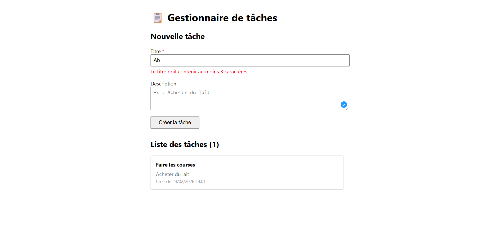
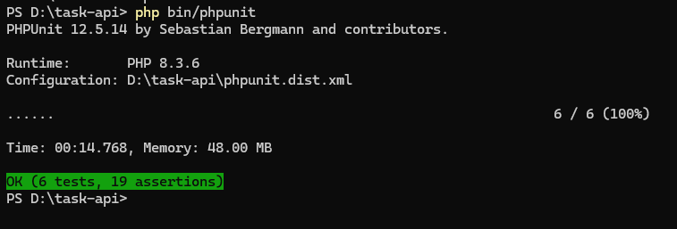

# Task Manager — Test technique Fullstack PHP/Symfony + React

Mini API de gestion de tâches avec un backend Symfony 7 et un frontend React 18 / TypeScript.

---

## Installation et lancement

### Prérequis

- PHP 8.2+
- Composer
- Node.js 18+
- npm

### Backend

```bash
cd task-api
composer install
```

Configurer la base de données SQLite dans `.env` :

```
DATABASE_URL="sqlite:///%kernel.project_dir%/var/data_%kernel.environment%.db"
```

Créer la base et appliquer les migrations :

```bash
php bin/console doctrine:migrations:migrate --no-interaction
```

Lancer le serveur :

```bash
symfony serve --port=8000
# ou : php -S localhost:8000 -t public/
```

### Frontend

```bash
cd frontend
npm install
npm start
```

L'application est accessible sur `http://localhost:3000`.

### Configuration CORS

La communication entre le frontend (port 3000) et le backend (port 8000) est gérée par le bundle `nelmio/cors-bundle`, déjà configuré dans `.env` via `CORS_ALLOW_ORIGIN`. Aucune action supplémentaire n'est nécessaire.

### Tests

```bash
php bin/phpunit
```

Le projet inclut 6 tests :
- **3 tests unitaires** (`TaskServiceTest`) : vérifient la logique du service en isolation avec un mock du repository.
- **3 tests fonctionnels** (`TaskControllerTest`) : testent les endpoints API de bout en bout — création réussie (201), validation échouée (400), et le flux complet création + listing.

Pas de tests frontend dans le scope actuel — ce serait une amélioration à ajouter (React Testing Library).

---

## Aperçu





---

## Choix techniques

### Architecture backend

**Controller → Service → Repository** : le controller est volontairement fin. Il ne fait que 3 choses : recevoir la requête, la valider, et déléguer au service. La logique métier est dans `TaskService`, l'accès aux données dans `TaskRepository`. Cette séparation facilite les tests unitaires et la maintenabilité.

**DTO (Data Transfer Object)** : un objet `CreateTaskDTO` est utilisé pour séparer les données d'entrée de l'entité Doctrine. Cela empêche d'exposer directement l'entité à l'input utilisateur et permet de valider les données avant de toucher à la base. La validation est centralisée sur le DTO uniquement — l'entité ne porte pas de contraintes Assert pour éviter toute duplication.

**Validation** : les contraintes sont définies via les attributs PHP 8 de Symfony Validator (`#[Assert\NotBlank]`, `#[Assert\Length]`) directement sur le DTO. Les erreurs sont retournées sous forme de JSON structuré avec un code HTTP 400, formatées par champ pour permettre un affichage précis côté frontend.

**Sérialisation** : les groupes de sérialisation (`#[Groups(['task:read'])]`) contrôlent explicitement ce qui est exposé dans l'API — évitant de renvoyer des données internes par accident.

**SQLite** : choisi pour la simplicité d'installation (pas besoin de MySQL pour un test). En production, on passerait à PostgreSQL ou MySQL sans changer le code applicatif grâce à l'abstraction Doctrine.

### Architecture frontend

**React + TypeScript** : typage fort pour attraper les erreurs à la compilation. Les interfaces TypeScript (`Task`, `CreateTaskPayload`) documentent le contrat avec l'API.

**Service API centralisé** : les appels HTTP sont isolés dans `services/taskApi.ts` — pas directement dans les composants. L'URL de l'API est externalisée dans une variable d'environnement (`REACT_APP_API_URL`). Ça facilite la maintenance et le déploiement.

**Mise à jour optimiste** : quand une tâche est créée, elle est ajoutée immédiatement dans le state local sans refaire un appel GET. Ça améliore la réactivité de l'interface.

**Gestion d'erreurs** : les erreurs de validation retournées par l'API sont affichées sous les champs concernés, pas en message générique.

---
